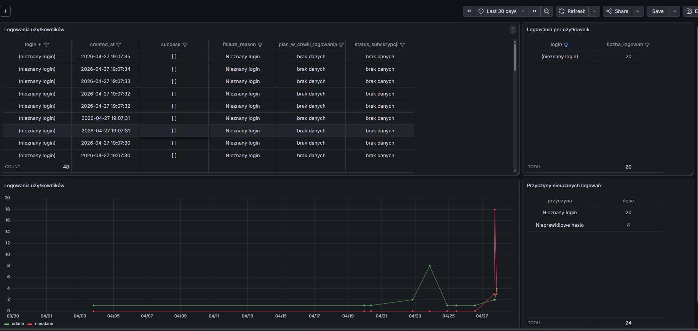

# BeSafeFish

Asystent computer vision automatyzujacy czynnosci w grze - aplikacja desktopowa + rejestracja przez strone WWW + baza w chmurze (PySide6, Flask API, PostgreSQL, ONNX).

- Strona WWW: https://kosa-h283.onrender.com
- Pobranie .exe: [GitHub Releases](https://github.com/kamilkacperczyk/BeSafeFish/releases/latest)
- Monitoring: [Grafana Cloud](https://kacperczyk95.grafana.net/) (prywatny - patrz sekcja Monitoring)
  dashboard PostgreSQL z aktywnoscia uzytkownikow, ze względów bezpieczeństwa -niedostepny publicznie,
  Przykladowy podglad co przedstawia ponizej:

<a href="app/docs/screenshots/grafana-besafefish-psql-monitoring-screen.png"></a>

## Jak dziala

1. Przechwytuje region mini-gry z ekranu (mss)
2. Rozpoznaje stan: bialy okrag (czekaj), czerwony okrag (klikaj), HIT/MISS (ignoruj)
3. Lokalizuje rybke (background subtraction + PatchCNN ONNX)
4. Klika w rybke gdy okrag jest czerwony (pydirectinput)

## Architektura

```
[Uzytkownik]
    |-- [Aplikacja .exe] --HTTP/JSON--> [Flask API (Render.com)] --psycopg2--> [Supabase PostgreSQL]
    |-- [Strona WWW]     --HTTP/JSON--> [Flask API (Render.com)] --psycopg2--> [Supabase PostgreSQL]
```

Aplikacja .exe NIE laczy sie bezposrednio z baza - komunikuje sie przez API serwera.

## Struktura repo

```
app/                      -- Wszystko co nad trybami (GUI, website, baza, docs)
  besafefish.py           -- Entry point GUI
  BeSafeFish.spec         -- Konfiguracja PyInstaller
  gui/                    -- GUI PySide6 (login, rejestracja, dashboard)
  website/                -- Strona WWW + Flask backend (server.py, render.yaml)
  SQL/                    -- Definicje tabel i funkcji PostgreSQL
  docs/                   -- Dokumentacja projektu

versions/
  tryb1_rybka_klik/       -- Tryb 1: "Mini-gra łowienie ryb (rybka - klik)"
    README.md             -- Opis trybu i jego wariantow
    tests/                -- Analizy, kalibracja, diagnostyka, walidacja
    post_cnn/             -- Aktywny wariant (klasyczny CV + PatchCNN ONNX)
    pre_cnn/              -- Archiwum (sam klasyczny CV, bez CNN)
  tryb2_dymek_spacja/     -- (Planowany) Tryb 2: "Mini-gra spacja (dymek z cyfrą)"
```

## Uruchomienie (deweloper)

Z rootu repo:

```bash
pip install -r requirements.txt
py app/besafefish.py
```

## Budowanie .exe

Z rootu repo:

```bash
py -m PyInstaller app/BeSafeFish.spec --clean -y
```

Wynik: `dist/BeSafeFish/` - spakuj jako .zip i wrzuc do GitHub Releases.

## Baza danych

PostgreSQL na Supabase. 7 tabel: users, subscription_plans, user_subscriptions, payments, daily_usage, login_history, audit_log.

Szczegoly: `app/docs/struktura-bazy.md`

## Monitoring

Aplikacja ma podpiety dashboard w Grafanie - monitoruje aktywnosc bazy danych (logowania, plany subskrypcji, audit nieudanych prob). W przyszlosci dodamy tez metryki strony i ruchu sieciowego API.

## Dokumentacja

| Plik | Opis |
|------|------|
| `app/docs/deployment-i-architektura.md` | Architektura, API, Render, PyInstaller, migracja |
| `app/docs/struktura-bazy.md` | Diagram zaleznosci tabel, funkcje, triggery |
| `app/docs/historia-wersji.md` | Ewolucja bota (pre_cnn → post_cnn), co sie zmienilo |
| `versions/tryb1_rybka_klik/post_cnn/cnn/ARCHITEKTURA_CNN.md` | Architektura sieci CNN, pipeline treningowy |
| `SECURITY.md` | Polityka bezpieczenstwa, pre-commit hook |
